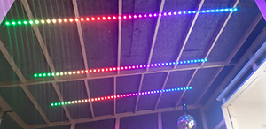
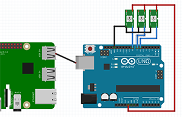
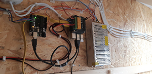
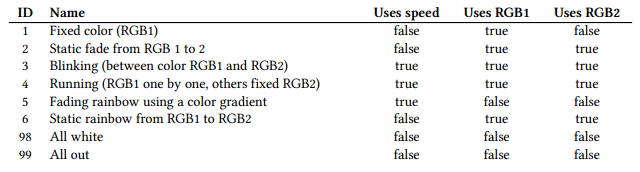
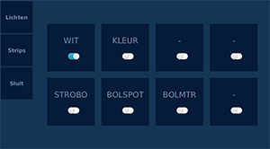
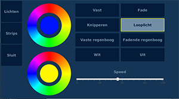
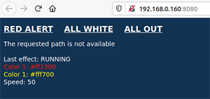
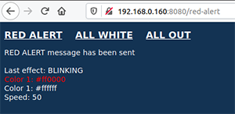

# Drum booth controller

JavaFX UI running on Raspberry Pi with relays and a serial connection to an Arduino to control the lights and LED strips in a drum booth.

This project combines multiple examples of the book ["Getting started with Java on Raspberry Pi"](https://leanpub.com/gettingstartedwithjavaontheraspberrypi/). All the sources of the examples in this book are freely available on [GitHub](https://github.com/FDelporte/JavaOnRaspberryPi). 



## History of this Project

As Java, JavaFX, and the used hardware has evolved, the main branch deviated from the original blog post.

### 202409 Waveshare Raspberry Pi Zero


### 202003 Raspberry Pi with I2C stack-on relays boards

Full description is available in this blog post: ["Drumbooth controller with Raspberry Pi and JavaFX"](https://webtechie.be/post/2020-03-30-drumbooth-controller-with-java-javafx-raspberrypi-arduino/).

If you need the sources of this version, please check-out the tag [i2c-relays](https://github.com/FDelporte/DrumBoothController/releases/tag/i2c-relays).

## Wiring

* Shared
  * USB cable between both boards (for serial communication)
  * 5V and ground from power supply to Pi, Arduino and LED strips
* Raspberry Pi
  * Raspberry Pi Zero 2 W
  * Mounted in a [Waveshare Industrial 6-ch Relay Module for Raspberry Pi Zero, RS485/CAN, Isolated Protections](https://www.waveshare.com/product/raspberry-pi/boards-kits/raspberry-pi-zero-2-w-cat/rpi-zero-relay.htm)
* Arduino
  * Control cable between pins 6, 7 and 8 to each of the three LED strips




## Commands between Java and Arduino application

The commands shared between both boards are strings in the structure “COMMAND_ID:SPEED:R1:G1:B1:R2:G2:B2”, where the command ID is one of the following options:



## Java application

### JavaFX user interface with three screens





### Undertow webpage to trigger some actions




## Build and run on Raspberry Pi

These instructions are intended to be used with an ARMv8 Raspberry Pi (RPi4+ or RPi Zero 2) with Raspberry Pi OS 64-bit. In the following code examples, the user account is `drum` and the hostname `drumbooth`.

### Install Visual Studio Code (if needed)

After initial startup, you can run the following commands to also install Visual Studio Code if you want to test, modify, and/or build the code:

```shell
$ sudo apt update
$ sudo apt upgrade
$ sudo apt install code
```

### Enable Serial

The commands for the LED strips are sent via serial communication to the Arduino board, so it has to be enabled in `raspi-config`:

```shell
$ sudo rasp-config
  > 3 Interface Options
    > I6 Serial Port
      > Login shell: no
      > Serial hardware: yes
  > Finish
  > Reboot
```

### Build and Copy the JAR to the Raspberry Pi

Build and copy the files to your Raspberry Pi from your development PC. Create the `drumbooth` directory before executing these commands the first time.

```shell
$ mvn package
$ scp target/*dependencies.jar drum@drumbooth.local://home/drum/drumbooth
$ scp target/distribution/* drum@drumbooth.local://home/drum/drumbooth
$ scp scripts/start.sh drum@drumbooth.local://home/drum/drumbooth
```

### Running on Raspberry Pi

* Install JDK with JavaFX following the guidelines on :

```shell
$ sudo apt install gnupg ca-certificates curl
$ curl -s https://repos.azul.com/azul-repo.key | sudo gpg --dearmor -o /usr/share/keyrings/azul.gpg
$ echo "deb [signed-by=/usr/share/keyrings/azul.gpg] https://repos.azul.com/zulu/deb stable main" | sudo tee /etc/apt/sources.list.d/zulu.list
$ sudo apt update
$ sudo apt install zulu22-jdk
```

* Check the Java version:

```shell
$ sudo java -version
openjdk version "22.0.2" 2024-07-16
OpenJDK Runtime Environment Zulu22.32+15-CA (build 22.0.2+9)
OpenJDK 64-Bit Server VM Zulu22.32+15-CA (build 22.0.2+9, mixed mode, sharing)
```

* Download the JavaFX runtime

```shell
$ wget -O openjfx.zip https://download2.gluonhq.com/openjfx/22.0.2/openjfx-22.0.2_linux-aarch64_bin-sdk.zip
$ unzip openjfx.zip
$ sudo mv javafx-sdk-22.0.2/ /opt/javafx-sdk/
$ rm openjfx.zip
```

* Run with the included script which can also be used at startup of the Pi to automatically launch the application

```
sudo bash /home/drum/drumbooth/start.sh
```

### Kiosk mode

```shell
$ sudo apt update
$ sudo apt upgrade
$ sudo apt install libgl1-mesa-glx
```

### TFT screen


Settings to be added to config.txt

```text
max_usb_current=1
hdmi_force_hotplug=1
config_hdmi_boost=10
hdmi_group=2
hdmi_mode=87
hdmi_cvt 1024 600 60 0 0 0
```

## Arduino project

http://wiki.openmusiclabs.com/wiki/ArduinoFHT
http://wiki.openmusiclabs.com/wiki/FHTExample
	
### Application

Controls three WS2812 LED strips with the same effect. Code is separated into multiple file so it's easier to understand and maintain.

### Inspired by

* [Music Reactive LED Strip ](https://create.arduino.cc/projecthub/buzzandy/music-reactive-led-strip-5645ed)

