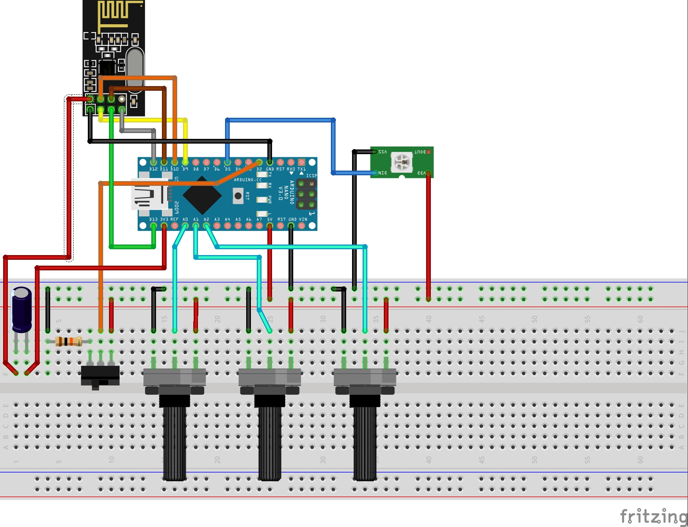

# DrumLights
Arduino project with
* one as master with control elements
* multiple wireless slaves with RGB led lights

## One Arduino code for multiple Arduino boards

### One master board
* Switch to configure as master board
* 3 pot meters for R/G/B mixing
* Radio to transmit selected color codes to the slaves
* Controls own RGB led strip

### Multiple slave boards
* Radio to receive selected color codes from the master
* Control of RGB led strip according to received color code and effect

## Wiring
Slave is identical to master for radio and led strip, but doesn't have the master switch and potentio meters.

	
## Components

### LED Strip
* Type WS2812IC 
* https://www.dx.com/p/nrf24l01-2-4ghz-enhanced-wireless-modules-black-4-pcs-2057721

### Wireless
* NRF24l01
* https://www.dx.com/p/nrf24l01-2-4ghz-enhanced-wireless-modules-black-4-pcs-2057721

### Dependencies
Download and add to Arduino Libraries (e.g. in "C:\Program Files (x86)\Arduino\libraries"):
* https://github.com/nRF24/RF24
* https://github.com/FastLED/FastLED/archive/master.zip

## Inspired by
* https://create.arduino.cc/projecthub/muhammad-aqib/nrf24l01-interfacing-with-arduino-wireless-communication-0c13d4?ref=tag&ref_id=wireless&offset=10
* https://www.element14.com/community/community/raspberry-pi/raspberrypi2/blog/2015/04/07/raspberry-pi-2-gpio-usage-with-nrf24l01-arduino
* https://randomnerdtutorials.com/guide-for-ws2812b-addressable-rgb-led-strip-with-arduino/
